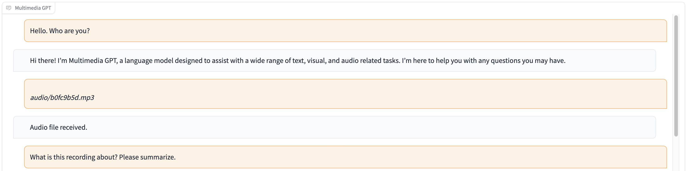

# Multimedia GPT

Multimedia GPT connects your OpenAI GPT with vision and audio. You can now send images, videos (in development), and even audio recordings using your OpenAI API Key, and get a response in both text and image formats. 

This project is made possible by a Prompt Manager and is inspired and built upon [Microsoft Visual ChatGPT](https://github.com/microsoft/visual-chatgpt). 

## Models
In addition to all of the vision foundation models mentioned in [Microsoft Visual ChatGPT](https://github.com/microsoft/visual-chatgpt), Multimedia GPT supports [OpenAI Whisper](https://openai.com/research/whisper), [OpenAI DALLE](https://openai.com/blog/dall-e-api-now-available-in-public-beta), and many more is under development! This means that **you no longer need your own GPUs for voice recognition and image generation** (although you still can!)

## Demo 



## Installation

```bash
# Clone this repository
git clone https://github.com/fengyuli2002/multimedia-gpt
cd multimedia-gpt

# Prepare a conda environment
conda create -n multimedia-gpt python=3.8
conda activate multimedia-gptt
pip install -r requirements.txt

# prepare your private OpenAI key (for Linux)
echo "export OPENAI_API_KEY='yourkey'" >> ~/.zshrc
# prepare your private OpenAI key (for Windows)
setx OPENAI_API_KEY “<yourkey>”

# Start Multimedia GPT !
# You can specify the GPU/CPU assignment by "--load", the parameter indicates which 
# foundation models to use and where it will be loaded to
# The model and device are separated by underline '_', the different models are separated by comma ','
# The available Visual Foundation Models can be found in the following table
# For example, if you want to load ImageCaptioning to cpu and Text2Image to cuda:0
# You can use: "ImageCaptioning_cpu,Text2Image_cuda:0"

# Don't have GPUs? No worry, you can run DALLE and Whisper using your API key!
python multimedia_gpt.py --load ImageCaptioning_cpu,DALLE_cpu,Whisper_cpu                     
```
