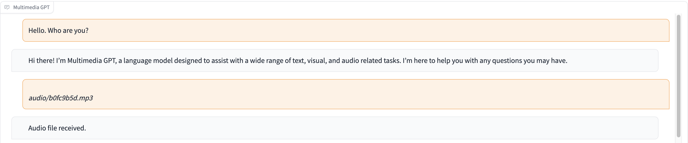

# Multimedia GPT

Multimedia GPT connects your OpenAI GPT with vision and audio. You can now send images and audio recordings using your OpenAI API key, and get a response in both text and image formats. Right now, we are exploring ways to connect even more modalities of data, such as videos, PDFs, webpages, etc. All is made possible by a prompt manager inspired and built upon [Microsoft Visual ChatGPT](https://github.com/microsoft/visual-chatgpt).

## Support Us
This project is under active development, and more features will be added soon. **Please consider :star: star us** or follow the [author](https://github.com/fengyuli-dev) if this idea is interesting to you. We thank all our [supporters](#supporters)!

## Models
In addition to all of the vision foundation models mentioned in [Microsoft Visual ChatGPT](https://github.com/microsoft/visual-chatgpt), Multimedia GPT supports [OpenAI Whisper](https://openai.com/research/whisper), [OpenAI DALLE](https://openai.com/blog/dall-e-api-now-available-in-public-beta), and many more is under development! This means that **you no longer need your own GPUs for voice recognition and image generation** (although you still can!)

The base chat model can be configured as **any OpenAI LLM**, including ChatGPT and GPT-4. We default to CharGPT `gpt-3.5-turbo`.

## Demo 
In this demo, ChatGPT is fed with a recording of [a person telling the story of Cinderella](public/cinderella.mp3).




## Installation

```bash
# Clone this repository
git clone https://github.com/fengyuli2002/multimedia-gpt
cd multimedia-gpt

# Prepare a conda environment
conda create -n multimedia-gpt python=3.8
conda activate multimedia-gptt
pip install -r requirements.txt

# prepare your private OpenAI key (for Linux / MacOS)
echo "export OPENAI_API_KEY='yourkey'" >> ~/.zshrc
# prepare your private OpenAI key (for Windows)
setx OPENAI_API_KEY “<yourkey>”

# Start Multimedia GPT!
# You can specify the GPU/CPU assignment by "--load", the parameter indicates which foundation models to use and 
# where it will be loaded to. The model and device are separated by '_', different models are separated by ','.
# The available Visual Foundation Models can be found in models.py
# For example, if you want to load ImageCaptioning to cuda:0 and whisper to cpu 
# (whisper runs remotely, so it doesn't matter where it is loaded to)
# You can use: "ImageCaptioning_cuda:0,Whisper_cpu"

# Don't have GPUs? No worry, you can run DALLE and Whisper on cloud using your API key!
python multimedia_gpt.py --load ImageCaptioning_cpu,DALLE_cpu,Whisper_cpu       

# Additionally, you can configure the which OpenAI LLM to use by the "--llm" tag, such as 
python multimedia_gpt.py --llm text-davinci-003  
# The default is gpt-3.5-turbo (ChatGPT).  
```

## Plans
### TODOs
- [x] Support OpenAI Whisper for speech recognition, added to the default config
- [x] Support OpenAI DALLE for image generation, added to the default config
- [x] Support OpenAI DALLE for image editing
- [x] Add a command-line switch between ChatGPT and GPT-4 backends
- [ ] Deploy a GPU-free basic version for interactive demo
### Known Problems
- [ ] DALLE only accepts square .png images — need a work-around
- [ ] Diffusion pipeline is insanely slow on CPU-machines; need to consider this in deployment

## Supporters
[](https://github.com/fengyuli-dev/multimedia-gpt/stargazers)
